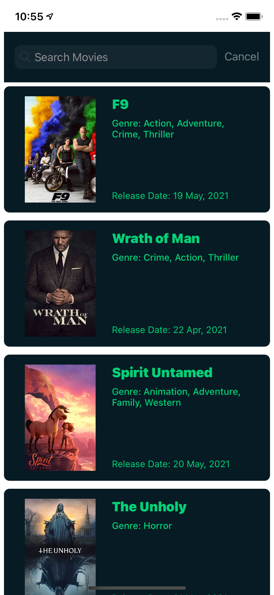
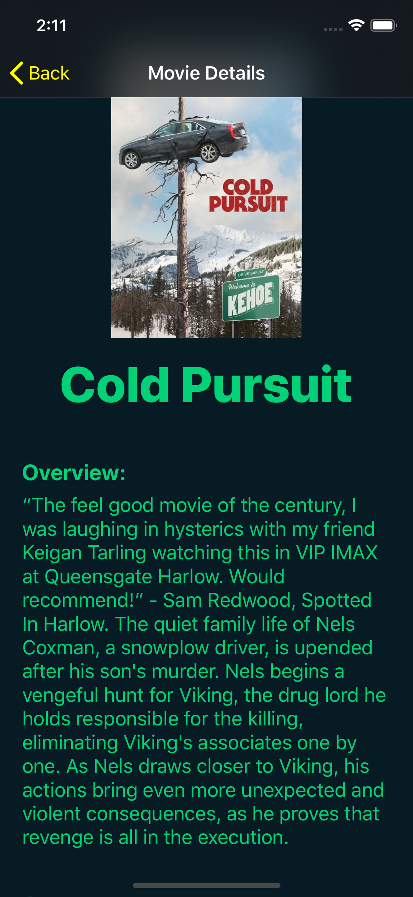

# The Movie Database

[](https://app.bitrise.io/app/a9088d3bd74f31ba) [](https://codebeat.co/projects/github-com-judarlima-themoviesdb-development)


1. [ Architecture. ](#architecture)
2. [ Features. ](#features)
3. [ Continuous Integration ](#ci)
4. [ Static Code Analysis ](#staticCodeAnalysis)
5. [ Code Coverage ](#codeCoverage)
6. [ Requirements ](#requirements)
7. [ Instructions ](#instructions)
8. [ Preview ](#preview)


<a name="architecture"></a>
## Architecture
- This project architecture is a variation of VIP, respecting SOLID and Clean Architecture principles.
- About the ViewModel, she doesn't contains business logic, her responsibility is only abstract the business model data into a struct that only makes sense to the presentation layer, trying not to expose those businesses model information at viewController.
- The layers into this architecture respect a unidirectional flow `(View Controller -> Interactor -> Presenter -> View Controller)`, this helps to prevents mistakes and issues like `reference cycles`.
<br><br>

<a name="features"></a>
## Features
#### Movie List
- Provides a list of upcoming movies through an infinite scroll.
- Provides the possibility of search for movies.

#### Movie Details
- Shows details of a movie, such as:
  - Movie Poster Image
  - Movie Title
  - Movie Overview
  - Movie Genres
  - Movie Release Date
  - Movie Backdrop Image

<a name="ci"></a>
## Continuous Integration
- This repository is integrated with `Bitrise` to helps to identify integration defects in the early stages of the project.
- The `Bitrise` label at this readme file shows quickly if the `master` is broken or if everything is fine(tests and build).

<a name="staticCodeAnalysis"></a>
## Static Code Analysis
- This repository is integrated with `Codebeat`. `Codebeat` gathers the results of code analysis into a single, real-time report that gives all project stakeholders the information required to improve code quality.

<a name="codeCoverage"></a>
## Code Coverage
- Unit Tests for:
  - HttpClient
  - Coordinator
  - Upcoming Movies Interactor
  - Upcoming Movies Gateway
  - Upcoming Movies Gateway Setup
  - Upcoming Movies Adapter
  - Upcoming Movies Presenter

<a name="requirements"></a>
## Requirements
- Xcode 10.2.1
- Swift 5

<a name="instructions"></a>
## Instructions
```bash
$ git clone https://github.com/judarlima/theMoviesDB.git
$ cd theMoviesDB/
$ git checkout development
$ cd MovieDataBase/
$ open MovieDataBase.xcodeproj
```

<a name="preview"></a>
## Preview
### Movies List


### Movie Detail

